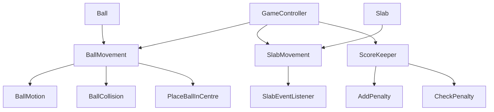
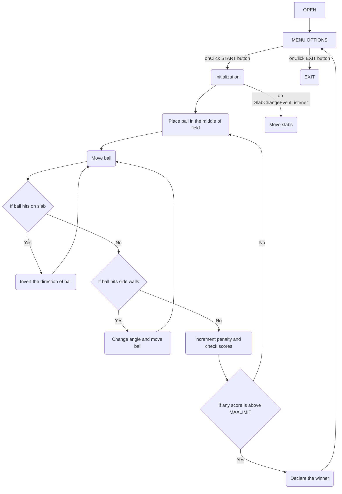

# The Essentials

1. Breakdown the problem into modules. Name each module
1. Rename the 'give-me-a-name...' files to reflect the module names.
Create more files for more modules.
Fill the responsibility and acceptance-criteria in each module.
1. Fill the sequence-start file with the details of module-interactions,
as indicated in that file.

## Components Diagram

## Flow Diagram

